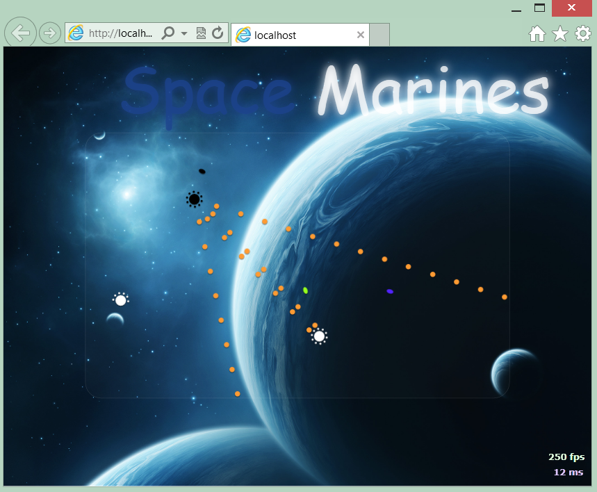
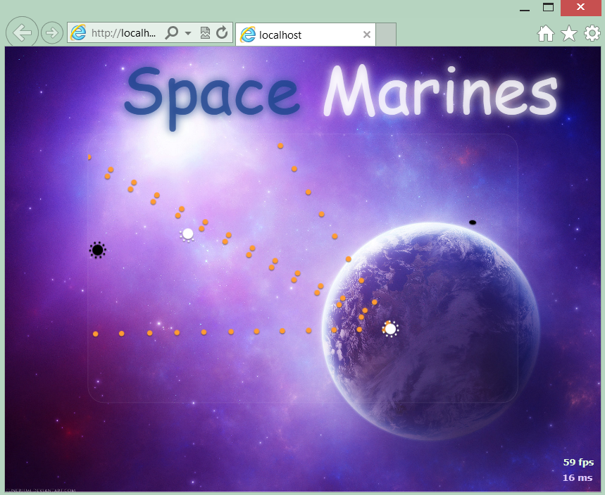
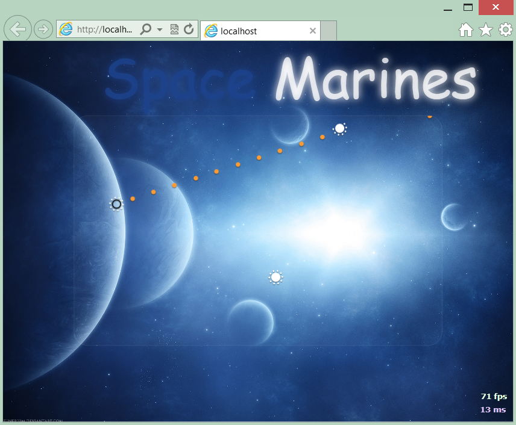
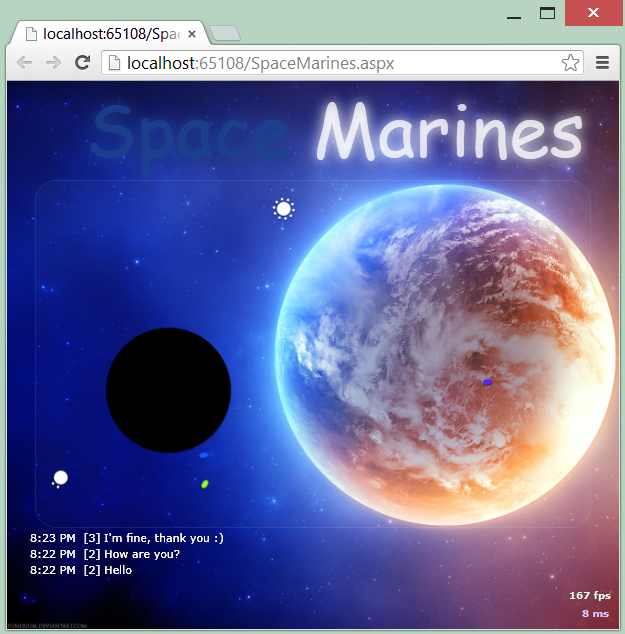
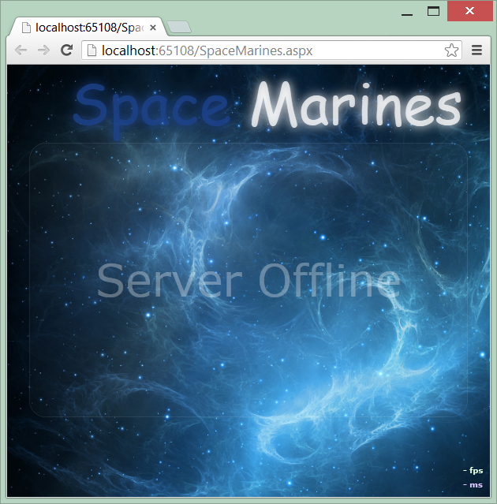
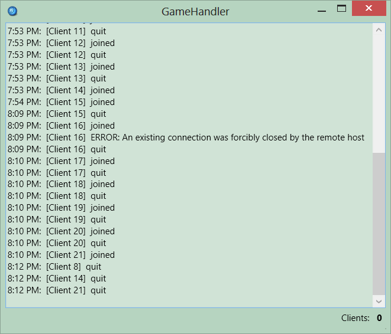

Space Marines
============

**Abstract**

Space Marines is a two-dimensional shooter whose aim is to provide a healthy conduit to the pursuit of happiness for all ages.  It is implemented using a distributed hybrid peer-to-peer architecture and seeks to abate the role of latency by utilizing concepts found in dead reckoning to extrapolate entity positioning.

**Introduction**

Space Marines is a two-dimensional shooter game in which the primary objective is to blow other players up.  The application is written in C# and leverages the Microsoft Silverlight application framework to facilitate online play.  The underlying network architecture utilizes a simple server-based system to set up games and tracks clients but primarily communicates between clients in a hybrid peer-to-peer fashion with the server simply rerouting packets sent between clients.  All this is accomplished with the use of sockets officiated by the transmission control protocol (TCP).  The application is able to handle moving and shooting in real time and resolves issues with latency between clients using the dead reckoning technique in order to minimize network traffic.  Various features implemented enhance gameplay and include player and weapon leveling logic and power-ups including stamina and health gain.  The game additionally supports a large range of complementary features including chat functionality, GPU utilization, a server polling process to maintain connectedness, all while operating within a web browser. 

**Documents**

[Final Paper](Documens/Final Paper.docx)
[Final Paper](Documents/Final Paper.pdf)
[Proposal](Documents/Proposal.docx)

**Screenshots**

**Firing**

**Firing 2**

**Invisible**

**Bomb**

**Server Offline**

**Server**

